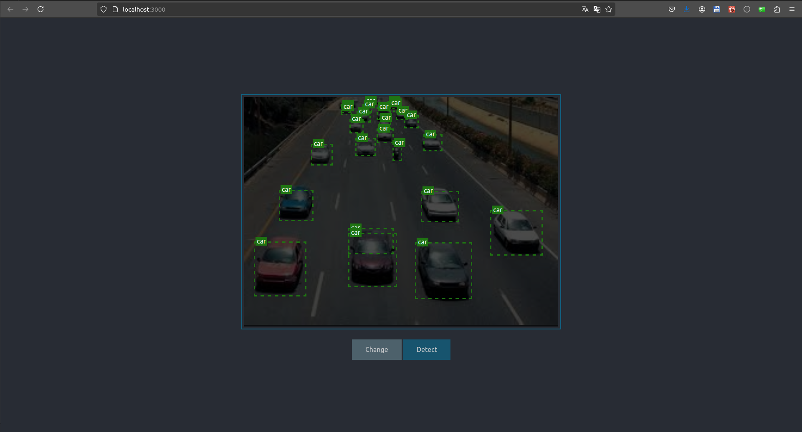

# detect_object

project aimed at detecting objects in images or videos (CI/CD - DEVSCOP)

## Features

- **API**: FastAPI-based API for object detection using YOLOv3.
- **Frontend**: React application for uploading files and displaying the results.
- **Object Detection**: Detect objects in images or videos and return the processed files with bounding boxes.

## Requirements

- Python (3.10+)
- Node.js (21.7.3)
- yarn (1.22.22)

## Project Structure

```bash
detect-object/
├── detect-object-api/
│   ├── README.md
│   └── ...
├── detect-object-frontend/
│   ├── README.md
│   └── ...
```

1. `detect-object-api`
    
2. `detect-object-frontend`
    - `Home page`
        
    - `Detect page`
        

## Docker

- build the container of api and frontend parts
- run

    ```bash
        HOST=<your ip or hostname> docker compose up -d
    ```
