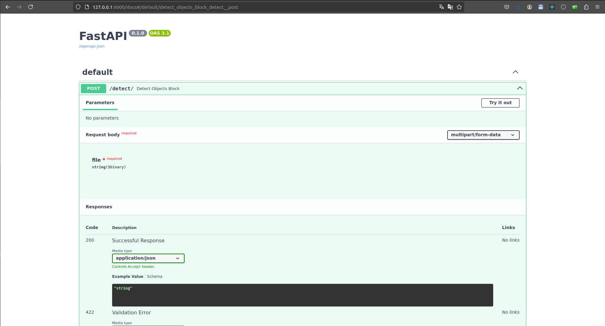

# Detect Object API

Detect Object API is a FastAPI-based web service for detecting objects in images or videos using the YOLOv3 (You Only Look Once) model. The API processes the input file and returns the processed image or video with bounding boxes around detected objects.

## Requirements

we use `Python 3.10+` and others requirements (library) are in a file `requirements.txt`.

## Installation

1. Create and activate a virtual environment (optional but recommended):

    ```bash
    apt-get update && apt-get install -y mesa-common-dev libgl1-mesa-dev
    python -m venv venv # or python3 -m venv venv
    source venv/bin/activate  # On Windows use `venv\Scripts\activate`
    ```

2. Load Yolo Model:

    ```bash
    bash load_model.sh
    ```

3. Install the required libraries:

    ```bash
    pip install -r requirements.txt
    ```

## Usage

1. Specify environements variables

    We have :
    - `FRONTEND_HOST` : host of a frontend
    - `FRONTEND_PORT` :  port of a frontend

    You can specify its basicaly or by a env file `.env`, you can view a example in `example.env`

    ```properties
    FRONTEND_HOST="127.0.0.1"
    FRONTEND_PORT="3000"
    ```

2. Run the FastAPI server:

    ```bash
    fastapi run
    ```

3. The API will be available at `http://127.0.0.1:8000`, and her documentation at `http://127.0.0.1:8000\docs`.

    

4. Use the `/detect/` endpoint to detect objects in an image or video.

### Example: Detect Objects in an Image

You can use `curl` to test the image detection:

```bash
curl -X POST "http://127.0.0.1:8000/detect/" -F "file=@path_to_your_image.jpg" --output result.jpg
```

This command will send an image to the API and save the processed image with bounding boxes to `result.jpg`
