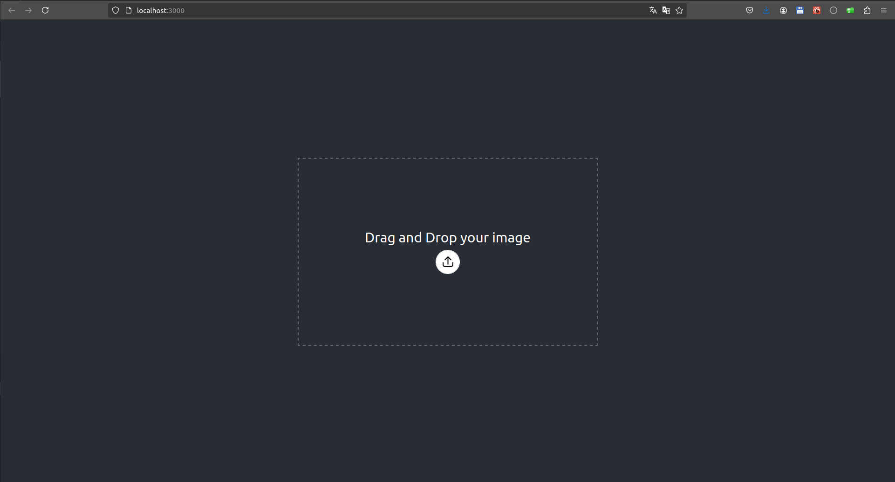
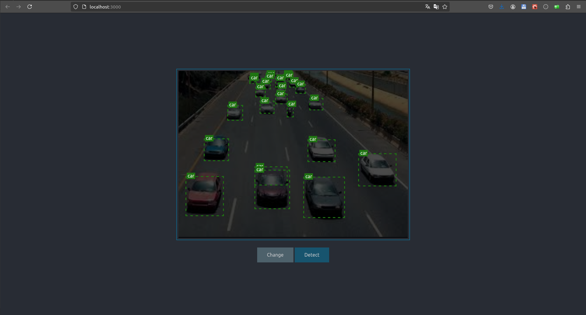

# Detect Object Frontend

Detect Object Frontend is a React application built with TypeScript ([Create React App](https://github.com/facebook/create-react-app)) for detecting objects in images or videos. This frontend interacts with the Detect Object API to process files and display the results.

## Requirements

- Node.js (21.7.3)
- yarn (1.22.22)

## Installation

1. Install Node.js and yarn :

```bash
yarn install --frozen-lockfile
```

## Usage

1. Specify environements variables

    We have :
    - `REACT_APP_API_HOST` : host of API
    - `REACT_APP_API_PORT` :  port of API
    - `REACT_APP_API_NOT_SECURE` : must use if a API is accessible by http

    You must do it by a env file `.env`, you can view a example in `example.env`:

    ```properties
    REACT_APP_API_HOST="127.0.0.1"
    REACT_APP_API_PORT="8000"
    REACT_APP_API_NOT_SECURE=
    ```

2. Start the development server:

    ```bash
    yarn start
    ```

3. Open your browser and navigate to `http://localhost:3000` to use the application.

    - `Home page`
        
    - `Detect page`
        
